# Awesome Workforce Identity & Single Sign-On (SSO) 🔐

  

  
  
  
  

---

## 🚀 Overview & Ecosystem Summary

Welcome to the **Awesome Workforce Identity & Single Sign-On (SSO)** curated directory! This repository tracks premier commercial workforce identity providers (IdP), enterprise single sign-on platforms, and open-source identity & access management (IAM) solutions.

Whether you are architecting a Zero Trust security framework, implementing SAML 2.0 / OpenID Connect (OIDC) federation, or deploying self-hosted authentication infrastructure, this list serves as your reference guide.

---

## 📑 Table of Contents

- [🏢 SaaS & Hosted Platforms](#-saas--hosted-platforms)
- [🌐 Open-Source GitHub Projects](#-open-source-github-projects)
- [🛠️ Key Protocols & Standards](#-key-protocols--standards)
- [🤝 How to Contribute](#-how-to-contribute)
- [⚠️ Disclaimer & Security Guidelines](#%EF%B8%8F-disclaimer--security-guidelines)
- [📈 Star History](#-star-history)
- [💖 Support & Community](#-support--community)

---

## 🏢 SaaS & Hosted Platforms

> 📊 **Market Overview**: The global Workforce Identity & Access Management (IAM/SSO) market size is estimated at **$18.5 Billion to $22.4 Billion** (growing at ~13.5% CAGR). The market structure is **moderately concentrated** at the top enterprise tier (dominated by key market leaders like Microsoft Entra ID and Okta), while remaining **moderately fragmented** across specialized developer B2B SSO platforms (such as WorkOS and Frontegg) and self-hosted open-source alternatives.

Below is the curated table of top SaaS/Hosted Workforce Identity & SSO platforms, sorted descending by company size (Valuation / Revenue):

| Platform | Company Size (Valuation / Revenue) | Starting Price | Free Tier Limit / Free Trial |
|---|---|---|---|
| 🏢 **[Microsoft Entra ID](https://www.microsoft.com/en-us/security/business/identity-access/microsoft-entra-id)** **The enterprise SSO standard** — cloud identity and access management with conditional access, MFA, and 10,000+ app integrations. | ~$3.1 Trillion Valuation ($245B+ Annual Revenue) | $6 / user / month (P1 Plan) | Free forever with M365/Azure; External ID free up to 50,000 MAUs |
| ☁️ **[AWS IAM Identity Center](https://aws.amazon.com/iam/identity-center/)** AWS's workforce SSO — centralized access management to AWS accounts and enterprise SaaS apps. | ~$2.1 Trillion Valuation ($620B+ Annual Revenue) | $0 / user / month (Included free with AWS) | Free forever (Unlimited for all AWS account users) |
| 🛡️ **[Duo Security](https://duo.com/)** **The leading MFA platform** (Cisco subsidiary) — two-factor authentication, SSO, and remote access. | ~$200 Billion Valuation (Parent Cisco; $2.35B acquisition) | $3 / user / month (Duo Essentials) | Free forever for up to 10 users; 30-day free trial for paid tiers |
| 🔑 **[Okta Single Sign-On](https://www.okta.com/products/single-sign-on/)** **The market-leading independent IdP** — SSO, MFA, lifecycle management, and API access management. | ~$42 Billion Valuation ($2.92B Annual Revenue) | $6 / user / month (Workforce Starter) | 30-day free trial (Workforce); Auth0 free tier up to 7,000 MAUs |
| 🔒 **[CyberArk Identity](https://www.cyberark.com/)** Workforce identity — SSO, MFA, and privileged access management (PAM). | ~$25 Billion Valuation ($1B+ Annual Revenue; Palo Alto acquisition) | $2 / user / month (Entry identity module base tier) | 30-day free trial for cloud access modules |
| ⚡ **[Ping Identity](https://www.pingidentity.com/)** Enterprise identity platform — SSO, MFA, and identity governance (Thoma Bravo). | ~$2.8 Billion Valuation ($800M ARR) | $3 / user / month (PingOne Workforce) | 30-day free trial for PingOne cloud solutions |
| 💻 **[JumpCloud](https://jumpcloud.com/)** **The cloud directory platform** — SSO, directory services, device management, and LDAP. | ~$2.6 Billion Valuation ($200M ARR) | $9 / user / month (Platform tier) | 30-day free trial (access to all platform features) |
| 🛠️ **[WorkOS](https://workos.com/)** **The modern enterprise SSO platform** — SSO, SCIM directory sync, and audit logs for B2B SaaS. | ~$2.0 Billion Valuation ($30M ARR) | $125 / connection / month (Enterprise SSO/SCIM) | Free forever up to 1,000,000 MAUs (AuthKit User Management) |
| 🔄 **[OneLogin](https://www.onelogin.com/)** Workforce identity — SSO, MFA, and directory integration (One Identity / Quest). | ~$500 Million Valuation ($60M ARR) | $2 / user / month (Advanced Plan) | 30-day free trial (includes Developer trial access) |
| 🚀 **[Frontegg](https://frontegg.com/)** **The customer identity platform** — SSO, MFA, and user management for B2B SaaS. | ~$100 Million Valuation ($7.2M ARR / $70M total funding) | $99 / month (Growth Plan starting tier) | Free forever up to 7,500 MAUs (Launch Plan) |

---

## 🌐 Open-Source GitHub Projects

Workforce identity is one of the strongest open-source software domains. The repositories below provide production-grade identity providers (IdPs), authentication proxies, and governance solutions.

Repos are sorted descending by GitHub Stars_Count:

1. **[Keycloak](https://github.com/keycloak/keycloak)**   
   👑 **The de facto open-source identity provider** (Apache-2.0). Supports OAuth 2.0, OpenID Connect (OIDC), SAML 2.0, User Federation (LDAP/AD), Identity Brokering, and social login. Includes a comprehensive admin console and fine-grained authorization. **Best for enterprise-grade, battle-tested self-hosted IAM.**

2. **[Authelia](https://github.com/authelia/authelia)**   
   ⚡ **Lightweight open-source authentication & authorization server** (Apache-2.0). Provides 2FA/MFA, SSO, and forward-auth for reverse proxies like Nginx, Traefik, Caddy, and HAProxy. **Best for securing self-hosted applications and homelabs.**

3. **[Authentik](https://github.com/goauthentik/authentik)**   
   🎨 **Flexible flow-based open-source IdP** (GPL-3.0). Supports OAuth2/OIDC, SAML, LDAP, and proxy authentication. Features a visual flow editor for customizing login, registration, and MFA pipelines. **Best for teams requiring flexible authentication workflows.**

4. **[Ory Hydra](https://github.com/ory/hydra)**   
   🛡️ **Hardened OpenID Certified™ OAuth 2.0 & OpenID Connect Server** (Apache-2.0). Headless and API-first, designed to integrate seamlessly into existing login UIs. **Best for cloud-native OAuth2 / OIDC token issuer architecture.**

5. **[SuperTokens](https://github.com/supertokens/supertokens-core)**   
   🔑 **Developer-friendly open-source authentication architecture** (Apache-2.0). Offers end-to-end session management, SSO, social login, and passwordless authentication with customizable SDKs. **Best for web and mobile app authentication.**

6. **[Logto](https://github.com/logto-io/logto)**   
   🚀 **Modern open-source Auth0 alternative** (MPL-2.0). Provides OIDC-based identity management, multi-tenancy, machine-to-machine (M2M) auth, and ready-to-use SDKs. **Best for B2B and consumer SaaS applications.**

7. **[Ory Kratos](https://github.com/ory/kratos)**   
   ⚙️ **API-first cloud-native identity management server** (Apache-2.0). Handles user management, registration, account recovery, MFA, and passkeys/FIDO2. **Best for building headless custom identity solutions.**

8. **[Dex](https://github.com/dexidp/dex)**   
   ☸️ **Open-source OIDC identity provider and federation engine** (Apache-2.0). Acts as a portal to federate authentication against SAML, LDAP, OAuth2, and GitHub for Kubernetes clusters and infrastructure. **Best for Kubernetes authentication.**

9. **[Casdoor](https://github.com/casdoor/casdoor)**   
   🖥️ **UI-first identity & access management platform** (Apache-2.0). Supports OAuth2, OIDC, SAML, LDAP, CAS, webauthn, and multi-tenant management out of the box. **Best for UI-driven enterprise IAM deployment.**

10. **[Zitadel](https://github.com/zitadel/zitadel)**   
    Modern, API-first identity infrastructure with turnkey multi-tenancy, audit logging, OIDC/SAML2, Passkeys/FIDO2, and SCIM 2.0 (Apache-2.0). **Best for multi-tenant B2B SaaS.**

11. **[LLDAP](https://github.com/lldap/lldap)**   
    Lightweight, simplified LDAP server tailored for self-hosted services and user management without standard LDAP complexity (GPL-3.0). **Best for lightweight self-hosted user directories.**

12. **[Pomerium](https://github.com/pomerium/pomerium)**   
    Identity-aware access proxy delivering BeyondCorp-style Zero Trust access with seamless SSO integration (Apache-2.0). **Best for securing internal services without VPNs.**

13. **[Kanidm](https://github.com/kanidm/kanidm)**   
    Modern identity management platform written in Rust (MPL-2.0). Fast, memory-safe identity provider supporting RADIUS, OAuth2, and WebAuthn. **Best for Rust ecosystems and secure infrastructure.**

14. **[WSO2 Identity Server](https://github.com/wso2/product-is)**   
    Enterprise-grade open-source IAM platform (Apache-2.0). Features adaptive authentication, identity federation, privacy compliance, and identity governance. **Best for large enterprise deployments.**

15. **[Apache Syncope](https://github.com/apache/syncope)**   
    Open-source Identity Governance and Administration (IGA) solution (Apache-2.0). Manages user provisioning, de-provisioning, role assignment, and compliance reporting. **Best for identity governance and audit compliance.**

---

## 🛠️ Key Protocols & Standards

| Protocol | Full Name | Use Case | Key Features |
|---|---|---|---|
| 🔑 **OIDC** | OpenID Connect | Modern Web & Mobile SSO | Built on OAuth 2.0; issues JSON Web Tokens (JWT) ID tokens |
| 🛡️ **SAML 2.0** | Security Assertion Markup Language | Enterprise Federated SSO | XML-based assertions; standard for enterprise SaaS integration |
| 🔒 **OAuth 2.0** | Open Authorization 2.0 | API Authorization | Token-based authorization framework for third-party access |
| 👥 **SCIM 2.0** | System for Cross-domain Identity Management | User Provisioning | REST API protocol for automated user provisioning and de-provisioning |
| 📁 **LDAP** | Lightweight Directory Access Protocol | Directory Queries | Centralized credential verification for internal servers & legacy apps |

---

## 🤝 How to Contribute

Contributions are warmly welcome! To add or update entries:

1. Fork this repository.
2. Edit `README.md` (keep descriptions objective and links official).
3. Ensure open-source additions include valid GitHub links and repository details.
4. Submit a Pull Request (PR) with a clear explanation.

Check out our curated list meta-collection at [Awesome-Awesome-Awesome](https://github.com/ishandutta2007/Awesome-Awesome-Awesome).

---

## ⚠️ Disclaimer & Security Guidelines

- This is a **community-curated reference list** — non-exhaustive and without commercial endorsement.
- Identity providers govern access to mission-critical infrastructure. Self-hosted deployments require continuous patching, multi-factor authentication (MFA) enforcement, and strict secret rotation.
- Identity is the primary security perimeter. Ensure public-facing IdPs use rate limiting, Web Application Firewalls (WAF), and automated intrusion detection.

---

## 📈 Star History

---

## 💖 Support & Community

Thank you for exploring this curated Workforce Identity & Single Sign-On ecosystem guide! If you find this repository helpful, please consider supporting the project:

- ⭐ **Star this repository** to help others discover it.
- 🍴 **Fork & Contribute** to expand the list with new tools or updates.
- 📢 **Share with your network** on LinkedIn, X (Twitter), or tech communities.
- ☕ **Sponsor / Buy me a coffee**: Support ongoing open-source maintenance on the [GitHub Sponsor Dashboard](https://github.com/sponsors/ishandutta2007).

  

